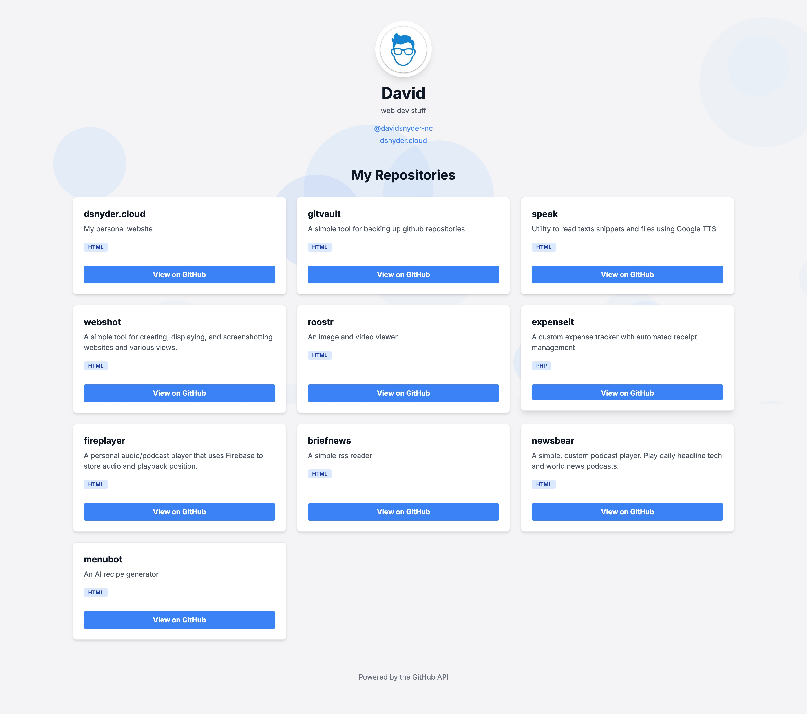

# Dynamic GitHub Portfolio Page

This is a single-page, dynamic portfolio website that automatically showcases your GitHub profile and public repositories. Built with vanilla JavaScript and Tailwind CSS, it fetches your data directly from the GitHub API, ensuring your portfolio is always up-to-date without any manual editing.

[Live Demo](https://davidsnyder-nc.github.io/) *(Replace with your live URL)*

## ✨ Features

-   **Always Up-to-Date**: Automatically fetches your latest profile information (avatar, name, bio) and repositories every time the page loads.
-   **Dynamic Repository Grid**: Displays all your public repositories in a clean, responsive grid, sorted by the most recently updated.
-   **Self-Filtering**: The script is configured to automatically hide the portfolio repository itself from the list for a cleaner presentation.
-   **Elegant UI**:
    -   A modern, minimalist design powered by Tailwind CSS.
    -   Supports both **Light and Dark Mode** based on system preference.
    -   Includes a subtle, animated background with floating circles for a touch of visual flair.
-   **Great User Experience**:
    -   Displays an animated **skeleton loading screen** while fetching data from the API.
    -   Handles API errors gracefully, showing a user-friendly message if data can't be fetched.
    -   Repository cards have a subtle hover effect, making the interface feel interactive.
-   **Zero Dependencies**: A completely self-contained `index.html` file that runs in any modern browser with no build step required.

## 🛠️ How It Works

The magic of this page lies in its simplicity. On page load, a vanilla JavaScript script performs the following actions:

1.  **Fetches User Data**: It makes an asynchronous `fetch` call to the GitHub API endpoint `https://api.github.com/users/{username}`.
2.  **Populates Profile**: The response is used to dynamically update the header with your avatar, name, and bio.
3.  **Fetches Repositories**: A second `fetch` call is made to `https://api.github.com/users/{username}/repos` to get a list of your public repositories.
4.  **Renders Repo Cards**: The script then iterates through the list of repositories, dynamically creating and inserting a styled "card" for each one into the main content area.
5.  **DOM Manipulation**: All content is rendered by creating and manipulating DOM elements directly, showcasing the power of modern vanilla JavaScript.

## 💻 Technologies Used

-   **HTML5**
-   **JavaScript (ES6+ with async/await)**
-   **Tailwind CSS** (via CDN)
-   **Google Fonts** (Inter)
-   **GitHub API**

## 🚀 Setup & Customization (Make It Your Own!)

This project is designed to be easily adapted for your own portfolio. You only need to change **one line of code**.

### Step 1: Get the Code
Fork this repository to your own GitHub account, or simply download/copy the `index.html` file.

### Step 2: Change the Username
Open the `index.html` file in a text editor. Find the `<script>` tag at the bottom of the file and locate this line:

```javascript
const username = 'davidsnyder-nc';
```

Change the value `'davidsnyder-nc'` to **your GitHub username**.

```javascript
// Change this to your GitHub username!
const username = 'your-github-username';
```

### Step 3: Deploy with GitHub Pages (Optional)
This project is perfectly suited for hosting on GitHub Pages.
1.  Ensure your repository is named `<your-username>.github.io`.
2.  Push your modified `index.html` file to the `main` branch.
3.  Enable GitHub Pages in your repository settings (if it's not already enabled).
4.  Your new portfolio will be live at `https://<your-username>.github.io`!

That's it! The page will now automatically display your profile and projects.

## 📄 License

This project is open source and available under the [MIT License](LICENSE).
<br><br>
